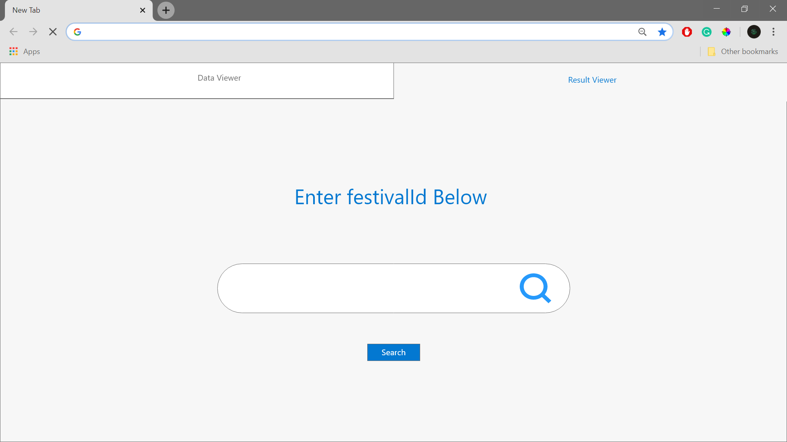
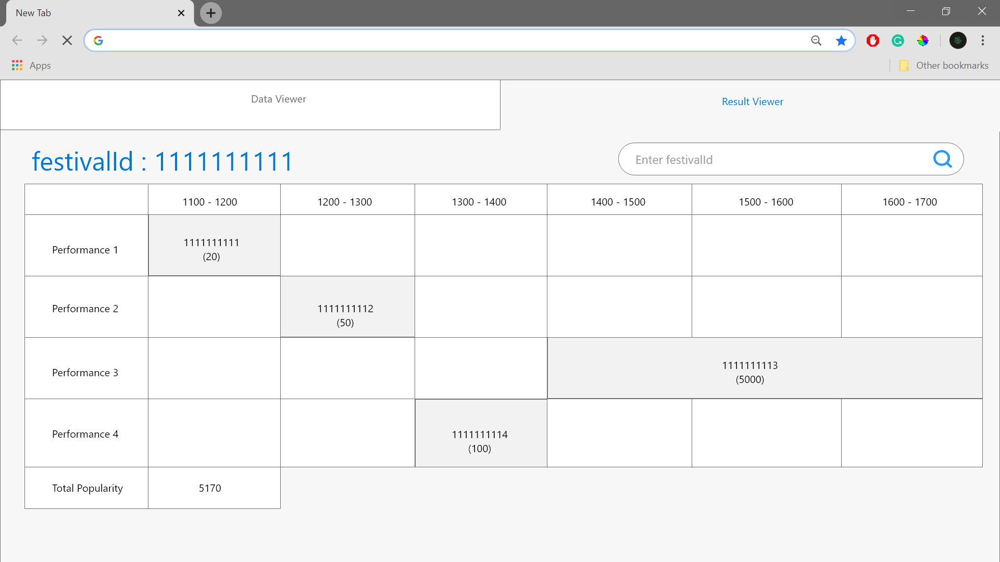

## Wireframe

## Wireframe part 1

## Wireframe part 2

## Justifications

### Justification 1

#### Good Points

1. Well color-coded to represent the schedule which can be easily use for indicating the performances to be executed
2. Sufficient empty spaces for each performances to fit in their popularity and performance id
3. Extra spaces in the header allows the use of it for navigating through the application to other pages

#### Bad Points

1. Hard to implement a clear table header for time of the performances due to lack space
2. Each performance will be represented by one line instead of clustering all into one line if they can stack, as such there is no point implementing a tough UI like this
3. Search bar is not neccessary for result viewer
4. No spaces for the user to enter more performances to be calculated

### Justification 2

#### Good Points

1. Usage of arrows can better indicate the flow of performances to watch
2. Header comes with magnifications can allow zoom in and out of the page for better view according to the user's needs
3. Sufficient space for each performance to allow display of further details such as popularity and performance id
4. Each performances can be expanded on hover to display further less important details if requested by the user

#### Bad Points

1. Left sidebar header is not neccessary since there is sufficient space for each performances bars to include the performance id and popularity. In addition, each performances can be click to expand more details regarding the performance as well
2. No spaces for the user to enter more performances to be calculated
3. Timeline unable to have sufficient space to represent the time as table header, as such, the time of each performance will be hidden from the user, a hover to display has to be implemented and direct display of important data is not possible

### Justification 3

#### Good Points

1. Time header can be clearly display with this format of showing data
2. Arrows can better indicate the flow of performances to be watched
3. Headers at the left side can be used to indicate performance id if there is a lack of space to indicate in the table directly

#### Bad Points

1. No space to include a field for user input of additional data to be added in
2. Border color and indication of timeline line color is light, maybe hard for user to see the timeline clearly or mislook the performance start and end time
3. Font size of headers on both horizontal and vertical must be small to fit into the big size of the table
