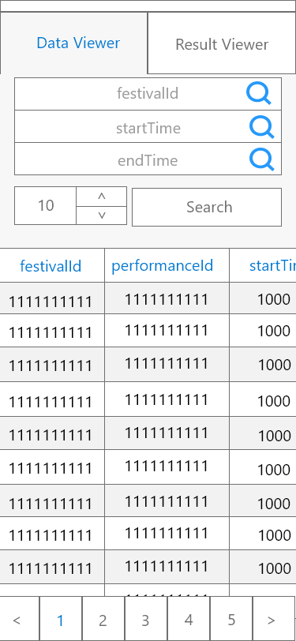
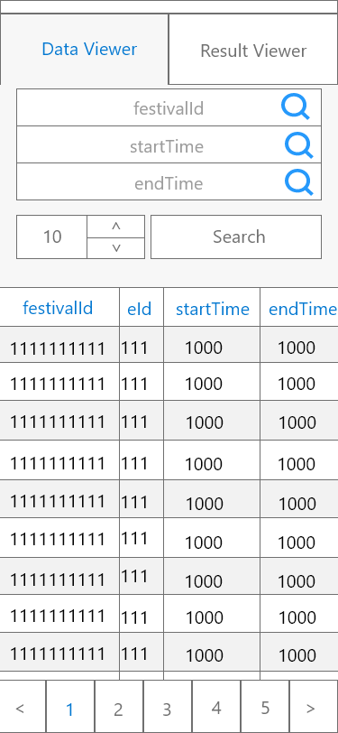

## Wireframe
### Wireframe part 1

### Wireframe part 2

## Justifications

### Justification 1

#### Good Points

1. Able to fit all datas into one page for mobile view efficiently
2. Header background color is darker with greater weight of text, clearly indicates the column header
3. Search bar is included for ease of searching of data

#### Bad Points

1. Might be squeezy for a whole table row to be included in the table, could have implement kebab icon for further less important data to be showed for each performances
2. No pagination
3. No space for data filtering to be done

### Justification 2

#### Good Points

1. Able to display all the datas in the table efficiently without squeezing of table columns
2. Data was well clustered and separated between each other using a different color background
3. Header was repeated to every single data for ease of reference of displayed data for the user

#### Bad Points

1. Data cannot be compared side to side in this manor
2. No space for search bar and filter button
3. No pagination will be done, implementing virtual scrolling is a must

### Justification 3

#### Good Points

1. Have extra spaces above to include search bar and filter options
2. Table is just nice to dislay datas for performance id, popularity, start time and end time
3. Bolding of performance id can better highlight to the user the row of the data being displayed
4. "Americas" header can be perfectly replaced with performances with popularity and end up with sufficient space due to extra spaces above the header

#### Bad Points

1. No search bar for searching of desired data
2. No filter options available
3. Tables with no headers is confusing to first time user as all the datas being display is foreign to the user and they will not understand what is the data about. This also makes user have a higher chance to confuse between start and end time of performances
4. No space below for pagination to be included, virtual scrolling must be implemented

1. 
