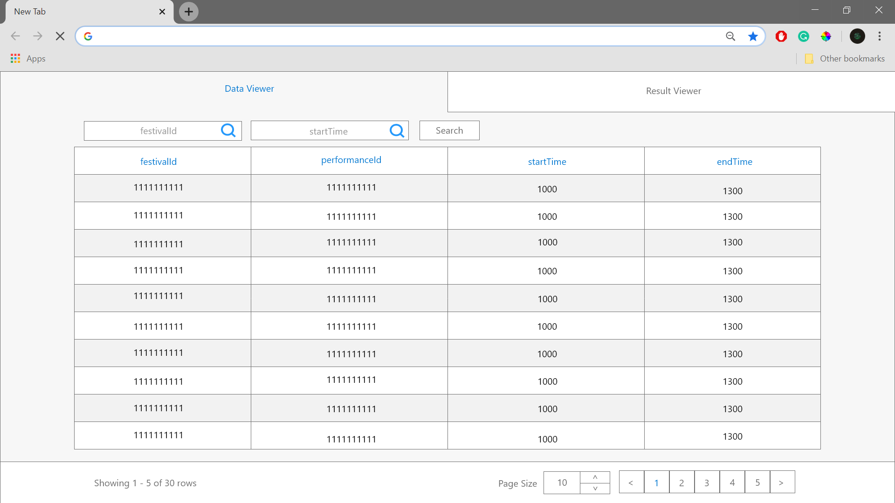

# Wireframe & Justification

## Wireframe

   The wireframe accommodates the three required functionalities: filtering by two attributes (festivalId and startTime), pagination and the data table. The design of the page lets user to easily identify which tab (data table or data viewer) they are on due to the color.
  
   Having to display only four columns of data, the data table is designed so that data displayed is not too far nor to near to each other. The table rows are seperated into two colors all done so for the purpose of clarity and ease of reading data.
  
   The two filtering search bars for "festivalId" and "startTime" are located top, right below the "data viewer" tab to allow convinient access. The filters are also close to their respective column headings for easy identification of data. The search bars have placeholder text which identifies which attribute it searches for.
  
   The pagination is right below the data table. Page number will have a different color to identify which page admin is on. 
   All functionalities are designed around the data table which allows the user to focus on the important part of the web page - the data table.
  
   The wireframe is bound to three main colors so that it does not come out as a distraction but as identification. Such as blue being used to determine a more important attribute within the page (page number/ tab / title). 
  
## Justifications

### Justification 1

  
#### Good Points

- Advanced filter for accurate search of data. The data viewer has a dropdown box to search for each individual column as well as  a dropdown for operators as a search function.
- Showing total number of rows can be useful for some instances.
- Pagination tool shows page number as well as next or previous page functionality.
- Amount of rows shown per page can be manipulated which can be useful to show more data.
- Sorting by columns can be useful for looking at data such as: ascending or descending order of numbers; Alphabetical order; Date created.
- Simple UI allowing admin to easily identify functionality of each button and also allows data to be viewed clearly.

#### Bad Points

- Data with many column may be bad as the data shown may be too compact which lowers clarity of the data viewer.
- No button for incrementing or reducing the number of rows shown can be ineffective in some instances.
- Pagination tool does not have a back to first page function.

### Justification 2

#### Good Points

- Pagination tool meets functionality requirement.
- Amount of rows shown per page can be manipulated which can be useful to show more data.
- Page size has a drop down which can be effective in some instances.
- Simple UI allows admin to easily locate appropriate data.

#### Bad Points

- May need more advanced search/filter system to search for different attributes and columns.
- Data with many column may be bad as it may look too compact making it hard to view data.

### Justification 3

*Please note that the numbering in the image has no correlation with the numbering below this text line.
#### Good Points

- Multiple search bar for each column is more efficient for data search. 
- A filter for each column is useful for narrowing down data to your liking. 
- Pagination tool meets functionality requirement. 
- Rows are collapsible which makes information more. 
- Columns are able to be resized which allows data with many columns to be more organized.
- Selected row is shaded in a different color for better clarity.

#### Bad Points

- Pagination UI looks too small.
- Does not show total number of rows which can be inefficient as a data viewer.
- The drop down table has inefficient column spacing which makes data in certain columns look very compact.
