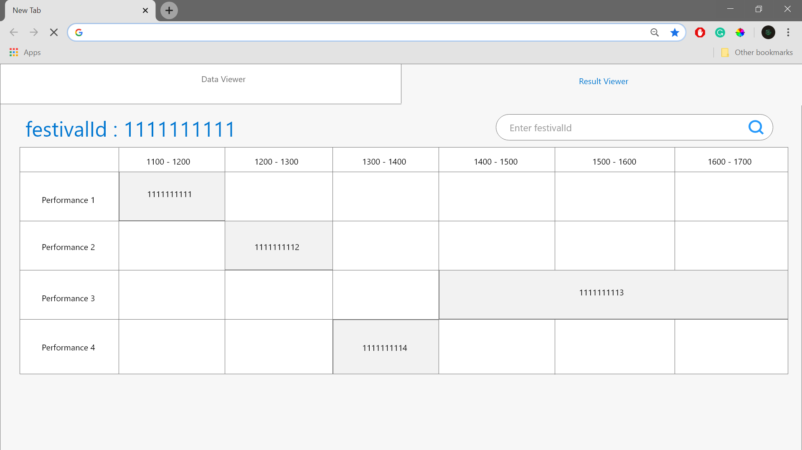

# Wireframe & Justification

This document should help you explain how your user interfaces are designed. You should have a wireframe to give a good overview and some screenshot with simple writeups to justify your designs.

## Wireframe

## Wireframe part 1

## Wireframe part 2

  Users will be directed to `Wireframe part 1` screen when have yet to key in search data for festivalId. By having as little UI as possible the wireframe designed hopes to let users easily understand how to use the web-app when first using it. The red sentence will only appear when users enter an invalid festivalId.
  
  After entering the correct computation information, users will be redirected to the `Wireframe part 2` where a timetable is used as the visual representation of the result. The performanceId will be displayed within the timetable so users will know which cells in the table is which performance. By using a timetable to show the result, the users will understand the data computed easily. If the user wants to search for another festivalId, instead of having to go back, a search bar is readily available at the top right of the screen. This is to allow easy and efficient use of the data viewer.

## Justifications

### Justification 1

#### Good Points
- Nice looking UI, easy to see the data.
- Tabs at are at the top left away from data, makes data viewer cleaner.
- Shows data to its respective task appropriately.

#### Bad Points
- May be hard to understand data without a key.
- Results with more data can look complicated as there are no horizontal lines to make the row clearer.

### Justification 2

#### Good Points

- UI looks great.
- Show data from the time and day correctly.
- Functions are easy to identify.

#### Bad Points

- Data with a larger text body may cause UI problems.
- May be hard to implement.

### Justification 3

#### Good Points
- Good looking UI
- Has a key to identify the colors of the tracks.
- Functions are relevant; such as add activity.
- Hovering for more information saves space and shows up only if user wants to see it.
- Easy to understand data from the result viewer.

#### Bad Points
- May be hard to implement.
- Start to end date has to be inferred from the UI. Would be better if it was labelled.
