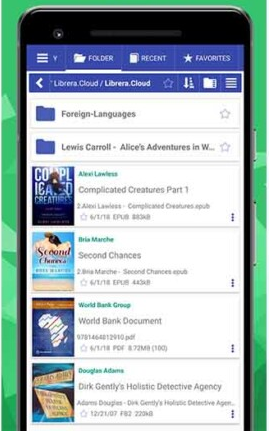

# Wireframe & Justification

## Wireframe
### Wireframe part 1

### Wireframe part 2

  Mobile wireframe contains all three required functionalities. The two filtering search bars are located at the top of the app and spans across the whole screen to allow users to easily tap on them. The page size is also at the top for the same purpose of letting the user access it more easily. Pagination takes up the entire bar at the bottom of the screen so that no space is wasted as well as allowing more screen area to let user easily navigate and use the pagination function.
  Due to the lesser estate that mobile has compared to web, having a data table fit inside a smaller screen can be harder. The wireframe designed compromises the space available with the amound of data visible. The data table is now scrollable which allows users to see the rest of the data as shown in `wireframe part 2`. However the festivalId is locked in place for the users to easily determine which data they are looking at.
## Justifications

### Justification 1

#### Good Points
- Display full details for each and row of data in the database in the first page so no navigation were required
- Able to give more stress and focus on the data value
- Dark color background makes the data to be more obvious and clear to compare when text were colored in bright color in comparison to white background color
- Header was empty and allow for filter buttons to be added or any advance features if required

#### Bad Points
- No filter button available or shown (Might be hidden under settings, which is not a clear navigation icon for filter purpose)
- Uses a scroll view instead of pagination system, which can make users hard to find the desire data out of all the data presented especially if the database pushes all the big amount of data into it
- Data was presented in a compact way without much font size difference which can make important data to be buried in the immense amount of data displayed

### Justification 2

#### Good Points
- Simple UI with easy navigation buttons at the bottom of the screen
- Categorized navigation throughout the UI guarantees ability to view desired data
- Ability to include icons makes navigation easier

#### Bad Points 
- Most data were hidden behind navigation links
- Too many navigation if used for a simple data viewer that consists of only a few tables at the back end
- Use of back button at the top of the screen is obstructive and unnecessary for Android users since most Android phones have a back button as navigation button in build in the phone
- No filter buttons as the navigation links ady replaces the need of filter button

### Justification 3

#### Good Points
- Each event were displayed as a navigation link with a title for easier navigation
- Partial data were displayed so an extra step of tapping into the navigation link to view data can be omitted
- Filter button at the top makes filtering easy

#### Bad Points
- Uses a scroll view instead of pagination system, which can make users hard to find the desire data out of all the data presented especially if the database pushes all the big amount of data into it
- All navigation buttons squeezed at the top of the screen may lead to difficulties in navigating the app
- Over display of less important data over more important data might occur due to the need to reduce font size of data displayed in the first page to fit into the size of the layout
- Big display of the images may cause the need to reduce font size to squeeze the data into the first page
