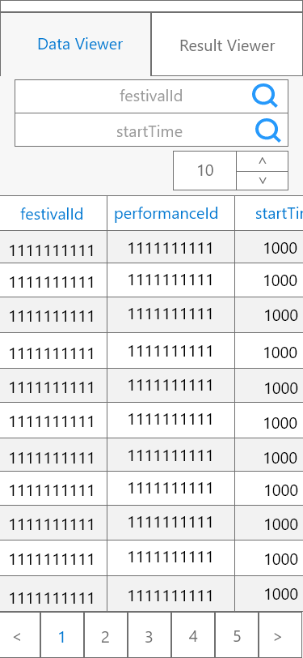
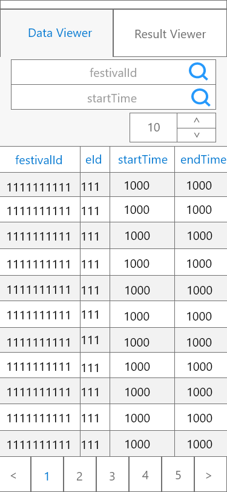
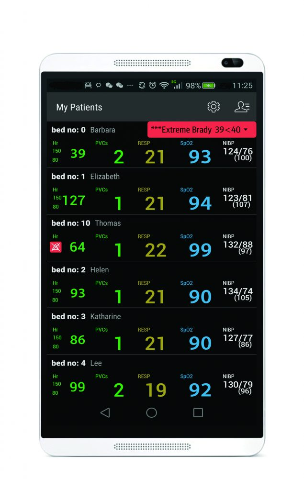

# Wireframe & Justification

## Wireframe
### Wireframe part 1

### Wireframe part 2

   Mobile wireframe contains all three required functionalities. The two filtering search bars are located at the top of the app and spans across the whole screen to allow users to easily tap on them. The page size is also at the top for the same purpose of letting the user access it more easily. Pagination takes up the entire footer of the screen so that no space is wasted as well as allowing more screen area to let user easily navigate and use the pagination function.
   
   By choosing a pagination system over a virtual scroll for a data table allows the user to locate data more efficiently as a paginated interface lets the user keep a mental location of the data. It also is good for when users are searching for a particular data and not just scanning through which makes sense to have for a data table.
  
   Due to the lesser estate that mobile has compared to web, having a data table fit inside a smaller screen can be harder. The wireframe designed compromises the space available with the amound of data visible. The data table is now scrollable which allows users to see the rest of the data as shown in `wireframe part 2`. However the festivalId is locked in place for the users to easily determine which data they are looking at.
## Justifications

### Justification 1

#### Good Points
- Display full details for each and row of data in the database in the first page so no navigation were required
- Able to give more stress and focus on the data value
- Dark color background makes the data to be more obvious and clear to compare when text were colored in bright color in comparison to white background color
- Header was empty and allow for filter buttons to be added or any advance features if required

#### Bad Points
- No filter button available or shown (Might be hidden under settings, which is not a clear navigation icon for filter purpose)
- Uses a scroll view instead of pagination system, which can make users hard to find the desire data out of all the data presented especially if the database pushes all the big amount of data into it
- Data was presented in a compact way without much font size difference which can make important data to be buried in the immense amount of data displayed

### Justification 2

#### Good Points
- Simple UI allows users to see data clearly
- Filter function as a fixed button on the screen allows convenient acceess
- Scrollable data table is good for tables with more columns
- Fixed identifier column allows users to know what row they are looking at
- Good use of space by having functions at the header together with the title.

#### Bad Points 
- Uses a scroll view instead of pagination makes it difficult to locate a data row to come back to it later. Pagination can act as a "bookmark" for the data row.
- Unused space to the left of the data table makes the data table narrower.
- Filter button does cover a small portion of the data table. It decreases visibility by a small amount.

### Justification 3

#### Good Points
- Table uses stripped color which makes it easier to look at a specific row.
- Table allows many columns without data being compressed.
- Progress bar UI at the top right allows users to identify how many columns and how far they scrolled horizontally through the data table.
- Data table allows sorting by tapping on the column header.
- Users are given the option to see more data if they want to.

#### Bad Points
- Uses virtual scrolling. Pagination would be more appropriate than having the option to load more rows.
- Over display of less important data over more important data might occur due to the need to reduce font size of data displayed in the first page to fit into the size of the layout
