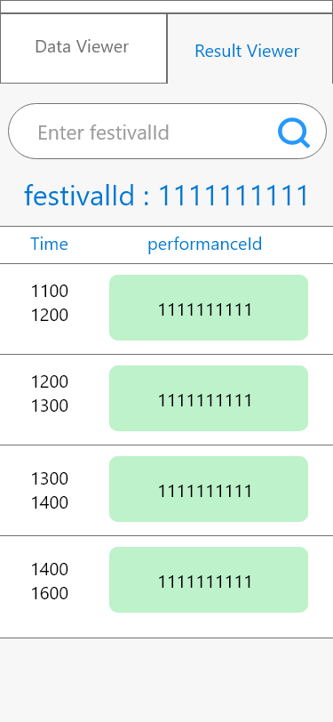

# Wireframe & Justification

## Wireframe
### Wireframe part 1

### Wireframe part 2

# Justifications

### Justification 1

###### Good Points

- Input using + and - button omits the need of on screen keyboard which blocks some information on the screen
- Can see the results of computation very clearly

###### Bad Points

- Does not have sufficient space for more field input
- Thick header takes up too much space

### Justification 2

###### Good Points

- Showing results in horizontal bars allows the comparison between one another to be done clearly rather than plain numbers
- Convenient edit button at the side of each horizontal bars allow quick edit of input information
- Plus icon at the top allows addition of new rows of input to be entered for ease of use to avoid the need to scroll to the bottom of the interface to input values

###### Bad Points

- Computed results displayed on this interface might looked same size as the input bars, creating a confusion to users when they have clicked to compute the result
- Values embedded in the horizontal bars cannot be seen clearly when it is not fully filled or empty as the color of the bar are not in contrast with the color of the embedded text values
- The UI has no space to fit in a "compute" button to begin the compute result

### Justification 3

###### Good Points

- The semi-circle was able to attract the attention of the users, making it a good spot to display results which will be the main point of this UI
- The semi-circle can be broken down into a few parts making it possible to show the length of each performance for our problem
- Plus icon at the top allows addition of new rows of input to be entered for ease of use to avoid the need to scroll to the bottom of the interface to input values

###### Bad Points

- No space to fit in the edit button for values to be input
- No space for the compute button
- The big result viewer takes up a lot of space of the screen, reduces the space reserved for input

